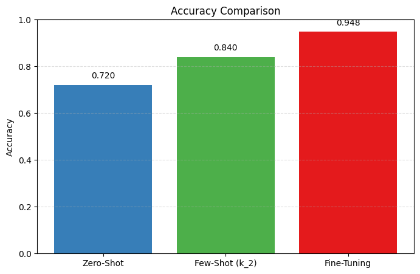
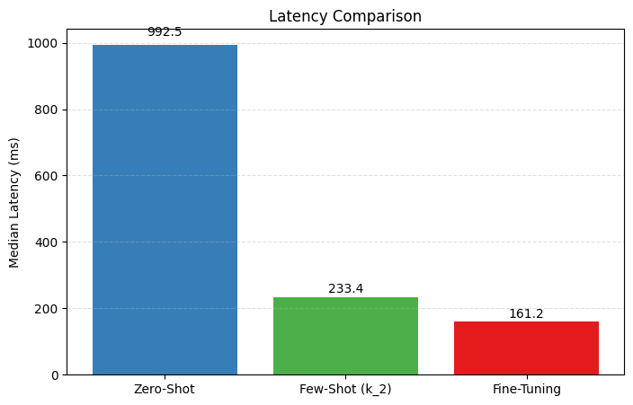
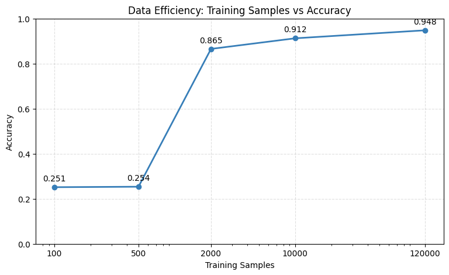

# Benchmark Text Classification with Hugging Face

## Project Overview

This repository benchmarks three text classification strategies on the AG News dataset:

- **Zero-Shot Classification**: use a pre-trained natural language inference model without any task-specific training.
- **Few-Shot Classification**: provide in-context examples to a prompt-based model and evaluate performance with a small number of examples.
- **Fine-Tuning**: train a DistilBERT classifier on labeled AG News examples and evaluate on held-out data.

The comparison is designed to highlight practical trade-offs in accuracy, latency, data efficiency, and operational cost.

## Dataset

The benchmark uses the **AG News** dataset with the following classes:

- World
- Sports
- Business
- Science/Technology

Dataset size:

- **Train:** 120,000 examples
- **Test:** 7,600 examples







## System Architecture

The benchmark workflow is organized into the following stages:

1. **Data Preparation** — load AG News and prepare train/test splits.
2. **Zero-Shot Evaluation** — classify test examples without labeled training data.
3. **Few-Shot Evaluation** — evaluate prompt-based classification with small k-shot examples.
4. **Fine-Tuning** — fine-tune DistilBERT on labeled training data.
5. **Inference Benchmarking** — measure model latency on representative workloads.
6. **Data Efficiency Analysis** — track accuracy as training examples increase.
7. **Results Aggregation** — merge all benchmark outputs into a single JSON artifact.

> Architecture diagram:
>
> ```text
> Data Preparation
>      ↓
> Zero-Shot Evaluation
>      ↓
> Few-Shot Evaluation
>      ↓
> Fine-Tuning
>      ↓
> Inference Benchmarking
>      ↓
> Data Efficiency Analysis
>      ↓
> Results Aggregation
> ```

## Repository Structure

```text
benchmark-text-classification/
├── Dockerfile
├── README.md
├── docker-compose.yml
├── requirements.txt
├── .env.example
├── src/
│   ├── config/
│   ├── data/
│   ├── evaluation/
│   ├── experiments/
│   ├── models/
│   ├── results/
│   └── utils/
├── outputs/
│   └── plots/
└── results/
```

## Setup Instructions

### Local Setup

Clone the repository and navigate into the project root:

```bash
git clone https://github.com/rakeshchinni77/benchmark-text-classification
cd benchmark-text-classification
```

### Virtual Environment Setup

Create and activate a local Python virtual environment:

```bash
python -m venv .venv
.venv\Scripts\activate      # Windows PowerShell
# or
source .venv/bin/activate   # macOS / Linux
```

### Install Dependencies

Install project dependencies:

```bash
pip install -r requirements.txt
```

### Run Experiments

This repository is designed to use precomputed benchmark results rather than retraining models in Phase 12.

To regenerate summary plots from `results/results.json`:

```bash
python -c "from src.results.generate_plots import generate_all_plots; generate_all_plots()"
```

## Docker Usage

Build and run the containerized environment:

```bash
docker-compose up --build
```

Expected repository outputs include:

- `outputs/plots/`
- `results/`

This command ensures the required runtime environment is built and validates the container workflow.

## Benchmark Results

The aggregated benchmark data is stored in `results/results.json`.

### Accuracy Comparison

| Method                | Accuracy |
| --------------------- | -------- |
| Zero-Shot             | 0.720    |
| Few-Shot (best k = 2) | 0.840    |
| Fine-Tuning           | 0.9479   |

### Latency Comparison

| Method                | Median Latency (ms) |
| --------------------- | ------------------- |
| Zero-Shot             | 992.456             |
| Few-Shot (best k = 2) | 233.416             |
| Fine-Tuning           | 161.202             |

### Data Efficiency

| Training Samples | Accuracy |
| ---------------- | -------- |
| 100              | 0.2514   |
| 500              | 0.2536   |
| 2,000            | 0.8653   |
| 10,000           | 0.9124   |
| 120,000          | 0.9479   |

## Analysis

- **Fine-Tuning achieved the best accuracy** because the model is directly optimized for the AG News classification task using labeled examples.
- **Few-Shot outperformed zero-shot** by using a small number of in-context examples to improve task understanding without requiring full training.
- **Inference latency improved with fine-tuning** because the trained DistilBERT classifier executes a single efficient forward pass, whereas few-shot inference includes additional prompt processing.

## Key Findings

- Fine-tuning is the most accurate approach when labeled data is available.
- Few-shot is a strong option when limited labeled data exists and training is not feasible.
- Zero-shot provides a fast baseline when no labels are available.
- The accuracy curve shows large gains from 500 to 2,000 training examples, making moderate labeled budgets especially valuable.

## Decision Flowchart

```text
      Start
        |
        v
Do you have labeled data?
        |
   +----+----+
   |         |
  No        Yes
   |         |
   v         v
Zero-Shot   Is dataset small?
             |
         +---+---+
         |       |
        Yes      No
         |       |
         v       v
     Few-Shot  Fine-Tuning
```

### When to choose each approach

- **Zero-Shot**: fast baseline with no training data.
- **Few-Shot**: small labeled examples are available, or training is expensive.
- **Fine-Tuning**: sufficient labeled data exists and maximum accuracy is required.

## Future Improvements

- Evaluate larger instruction-tuned and retrieval-augmented models.
- Add hyperparameter tuning for fine-tuning and prompt settings.
- Benchmark additional datasets beyond AG News.
- Extend support to multi-label and multilingual classification.
- Add cost and throughput benchmarking for production deployments.

## Conclusion

This benchmark provides a clear comparison of zero-shot, few-shot, and fine-tuning approaches on AG News. It delivers measurable accuracy and latency trade-offs, practical data-efficiency insights, and a decision guide to help ML engineers choose the right strategy.
